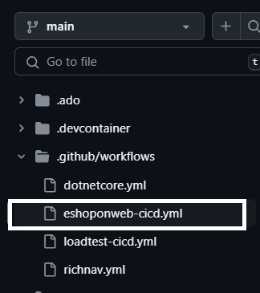

---
lab:
  title: 'Übung 02: Verwenden von GitHub Actions for Azure zum Veröffentlichen einer Web App in Azure App Service'
  module: 'Module 2: Implement GitHub Actions for Azure'
---

# Übersicht

In dieser Übung lernen Sie, wie Sie einen GitHub-Aktions-Workflow implementieren, der eine Azure-Web-App bereitstellt.

In diesem Lab lernen Sie Folgendes:

* Implementieren Sie einen GitHub Actions-Workflow für CI/CD.
* Erläutern der grundlegenden Merkmale von GitHub Actions-Workflows.

**Geschätzte Dauer des Abschlusses: 40 Minuten**

## Voraussetzungen

* Ein **Azure-Konto** mit einem aktiven Abonnement. Wenn Sie noch keines haben, können Sie sich unter [https://azure.com/free](https://azure.com/free) für eine kostenlose Testversion registrieren.
    * Ein vom Azure-Webportal unterstützter [Browser](https://learn.microsoft.com/azure/azure-portal/azure-portal-supported-browsers-devices).
    * Ein Microsoft-Konto oder ein Microsoft Entra-Konto mit der Rolle „Mitwirkender“ oder „Besitzer“ im Azure-Abonnement. Ausführliche Informationen finden Sie in den Artikeln zum [Auflisten von Azure-Rollenzuweisungen mithilfe des Azure-Portals](https://docs.microsoft.com/azure/role-based-access-control/role-assignments-list-portal) und [Anzeigen und Zuweisen von Administratorrollen in Azure Active Directory](https://docs.microsoft.com/azure/active-directory/roles/manage-roles-portal).
* Ein GitHub-Konto. Wenn Sie nicht über ein GitHub-Konto verfügen, das Sie für dieses Lab verwenden können, folgen Sie den Anweisungen unter [Für ein neues GitHub-Konto registrieren](https://github.com/join), um ein Konto zu erstellen.

## Anweisungen

## Übung 1: Importieren Sie eShopOnWeb in Ihr GitHub-Repository

In dieser Übung importieren Sie das [eShopOnWeb](https://github.com/MicrosoftLearning/eShopOnWeb)-Repository in Ihr GitHub-Konto. Das Repository ist wie folgt organisiert:

| Ordner | Contents |
| -- | -- |
| **.ado** | Azure DevOps-YAML-Pipelines |
| **.devcontainer** | Konfiguration zur Entwicklung mithilfe von Containern (entweder lokal in VS Code oder GitHub Codespaces) |
| **infra** | Bicep- und ARM-Infrastruktur als Code-Vorlagen, die in einigen Übungen verwendet werden |
| **.github** | YAML-GitHub-Workflowdefinitionen |
| **src** | Die in den Übungen verwendete .NET 8-Webseite |

### Aufgabe 1: Importieren des eShopOnWeb-Repository

1. Navigieren Sie in Ihrem Webbrowser zu GitHub [http://github.com](http://github.com) und melden Sie sich mit Ihrem Kontos an.
1. Starten Sie den Importvorgang [https://github.com/new/import](https://github.com/new/import).
1. Geben Sie die folgenden Informationen auf der Seite **Importieren Sie Ihr Projekt in GitHub** ein.

    | Einstellung | Aktion |
    |--|--|
    | **Die URL für Ihr Quell-Repository** | Geben Sie `https://github.com/MicrosoftLearning/eShopOnWeb` ein. |
    | **Besitzer** | Wählen Sie Ihren GitHub-Alias |
    | **Repositoryname** | Geben Sie **eShopOnWeb** ein |
    | **Datenschutz** | Nach Auswahl des **Besitzenden** erscheinen die Datenschutzoptionen. Wählen Sie **Öffentlich** aus. |

1. Wählen Sie **Import starten** und warten Sie, bis der Importvorgang abgeschlossen ist.
1. Wählen Sie auf der Repository-Seite **Einstellungen** und dann **Aktionen > Allgemein** im linken Navigationsbereich.
1. Wählen Sie im Abschnitt **Aktionsberechtigungen** der Seite die Option **Alle Aktionen und wiederverwendbare Workflows zulassen** und wählen Sie dann **Speichern**.

> **Hinweis:** Das eShopOnWeb ist ein großes Repository und es kann 5-10 Minuten dauern, bis der Import beendet ist.

## Übung 2: Erstellen von Azure-Ressourcen und Konfigurieren von GitHub 

In dieser Übung erstellen Sie ein Azure-Dienstprinzipal, um GitHub den Zugriff auf Ihr Azure-Abonnement über GitHub-Aktionen zu autorisieren. Sie überprüfen und ändern auch den GitHub Workflow, der Ihre Webseite erstellt, testet und in Azure bereitstellt.

### Aufgabe 1: Erstellen eines Azure-Dienstprinzipals und Speichern als GitHub-Geheimnis

In dieser Aufgabe werden Sie eine Ressourcengruppe und ein Azure-Dienstprinzipal erstellen. Das Dienstprinzipal wird von GitHub verwendet, um die gewünschte eShopOnWeb App bereitzustellen.

1. Navigieren Sie in Ihrem Browser zum Azure-Portal [https://portal.azure.com](https://portal.azure.com).
1. Öffnen Sie die **Cloud-Shell** und wählen Sie den **Bash**-Modus. **Hinweis:** Sie müssen den dauerhaften Speicher konfigurieren, wenn Sie die Cloud Shell zum ersten Mal starten.
1. Erstellen Sie eine Ressourcengruppe mit dem folgenden CLI-Befehl `az group create`. Ersetzen Sie `<location>` durch eine Region in Ihrer Nähe.

    ```
    az group create -n az2006-rg -l <location>
    ```

1. Führen Sie den folgenden Befehl aus, um sich den Ressourcenanbieter für den **Azure App Service** zu registrieren, den Sie später in der Übung bereitstellen werden.

    ```bash
    az provider register --namespace Microsoft.Web
    ```

1. Führen Sie den folgenden Befehl aus, um einen zufälligen Namen für die Web-App zu generieren, die Sie in Azure App Service bereitstellen. Kopieren und speichern Sie den Namen, den der Befehl ausgibt, um ihn später in dieser Übung zu verwenden.

    ```
    myAppName=az2006app$RANDOM
    echo $myAppName
    ```

1. Führen Sie die folgenden Befehle aus, um Ihre Abonnement-ID zu erhalten. Achten Sie darauf, die Ausgabe der Befehle zu kopieren und zu speichern. Der Wert der Abonnement-ID wird später in dieser Übung verwendet.

    ```
    subId=$(az account list --query "[?isDefault].id" --output tsv)
    
    echo $subId
    ```

1. Erstellen Sie ein Dienstprinzipal mit den folgenden Befehlen. Der erste Befehl speichert die ID der Ressourcengruppe in einer Variablen.

    ```
    rgId=$(az group show -n az2006-rg --query "id" -o tsv)

    az ad sp create-for-rbac --name GH-Action-eshoponweb --role contributor --scopes $rgId
    ```

    >**WICHTIG:** Dieser Befehl gibt ein JSON-Objekt aus, das die Identifikatoren enthält, die zur Authentifizierung gegen Azure im Namen einer Microsoft Entra-Identität (Dienstprinzipal) verwendet werden. Kopieren Sie das JSON-Objekt zur Verwendung in den folgenden Schritten. 

1. Navigieren Sie in einem Browserfenster zu Ihrem **eShopOnWeb** GitHub-Repository.
1. Wählen Sie auf der Repository-Seite **Einstellungen** und dann **Geheimnisse und Variablen > Aktionen** im linken Navigationsbereich.
1. Wählen Sie **Neues Repository-Geheimnis** und geben Sie die folgenden Informationen ein:
    * **NAME**: `AZURE_CREDENTIALS`
    * **Geheimer Schlüssel**: Geben Sie das JSON-Objekt ein, das bei der Erstellung des Dienstprinzipals erzeugt wurde.
1. Klicken Sie auf **Add secret** (Geheimnis hinzufügen).

### Aufgabe 2: Ändern und Ausführen des GitHub-Workflows

In dieser Aufgabe ändern Sie den bereitgestellten *eshoponweb-cicd.yml* GitHub Workflow und führen ihn aus, um die Lösung für Ihr eigenes Abonnement bereitzustellen.

1. Gehen Sie in einem Browserfenster zurück zu Ihrem **eShopOnWeb** GitHub-Repository.
1. Wählen Sie **<>Code** und wählen Sie im Hauptzweig die **eshoponweb-cicd.yml** im Ordner **eShopOnWeb/.github/workflows**. Dieser Workflow definiert den CI/CD-Prozess für die eShopOnWeb-App.

    
1. Wählen Sie **Bearbeiten Sie diese Datei**.
1. Ändern Sie die Felder im Abschnitt `env:` der Datei auf die folgenden Werte.

    | Feld | Aktion |
    |--|--|
    | RESSOURCENGRUPPE: | `az2006-rg` |
    | LOCATION: | `eastus` (Oder die Region, die Sie bei der Erstellung der Ressourcengruppe ausgewählt haben). |
    | TEMPLATE-DATEI: | Keine Änderungen |
    | ABONNEMENT-ID: | Ihre Abonnement-ID. |
    | WEBAPP-NAME: | Der zufällig generierte wep App-Name, den Sie zuvor in der Übung erstellt haben. |

1. Lesen Sie den Workflow aufmerksam durch, die Kommentare sind zum besseren Verständnis der einzelnen Schritte des Workflows bereitgestellt.
1. Dekommentieren Sie den Abschnitt **on** am Anfang der Datei, indem Sie `#` löschen. Der Workflow triggert bei jedem Push auf den Hauptzweig und bietet auch eine manuelle Triggerung (`workflow_dispatch`).
1. Wählen Sie **Änderungen bestätigen...** im oberen rechten Teil der Seite.
1. Es erscheint ein Popup-Fenster. Akzeptieren Sie die Standardeinstellungen (direkt in den Hauptzweig bestätigen) und wählen Sie **Änderungen bestätigen**. Der Workflow wird automatisch ausgeführt.

### Aufgabe 3: Überprüfen der Ausführung des GitHub-Workflows

In dieser Aufgabe überprüfen Sie die Ausführung des Workflows auf GitHub und sehen sich die laufende Anwendung an.

1.Wählen Sie **Aktionen** und Sie sehen das Workflowsetup vor der Ausführung.

1. Wählen Sie den Auftrag **eShopOnWeb Build and Test** im Abschnitt **Alle Workflows** der Seite aus. 

1. Der Workflow setzt sich aus zwei Vorgängen zusammen: **buildandtest** und **deploy**. Sie können einen der beiden Vorgänge auswählen und dessen Fortschritt ansehen oder warten, bis der Auftrag abgeschlossen ist.

1. Navigieren Sie zum Azure-Portal [https://portal.azure.com](https://portal.azure.com) und navigieren Sie zu der zuvor erstellten Ressourcengruppe **az2006-rg**. Beachten Sie, dass die GitHub-Aktion mithilfe einer Bicep-Vorlage einen Azure App Service Plan + App Service in der Ressourcengruppe erstellt hat. 

1. Wählen Sie die App-Service-Ressource (den zuvor generierten eindeutigen App-Namen) aus und wählen Sie dann **Durchsuchen** am oberen Rand der Seite aus, um die bereitgestellte Web-App anzuzeigen.

## Übung 3: Bereinigen von Ressourcen

In dieser Übung löschen Sie die zuvor in der Übung erstellten Ressourcen.

1. Navigieren Sie zum Azure-Portal [https://portal.azure.com](https://portal.azure.com) und starten Sie die Cloud Shell. Wählen Sie die **Bash**-Shell-Sitzung.

1. Führen Sie den folgenden Befehl aus, um die Ressourcengruppe `az2006-rg` zu löschen. Außerdem werden der App Service-Plan und diese Instanz entfernt.

    ```
    az group delete -n az2006-rg --no-wait --yes
    ```

    >**Hinweis**: Der Befehl wird asynchron ausgeführt (festgelegt mit dem Parameter `--no-wait`), so dass Sie zwar unmittelbar danach innerhalb derselben Bash-Sitzung einen anderen Azure CLI-Befehl ausführen können, es aber einige Minuten dauert, bis die Ressourcengruppen tatsächlich entfernt werden.

## Überprüfung

In diesem Lab haben Sie einen GitHub Action-Workflow implementiert, der eine Azure-Web-App bereitstellt.
